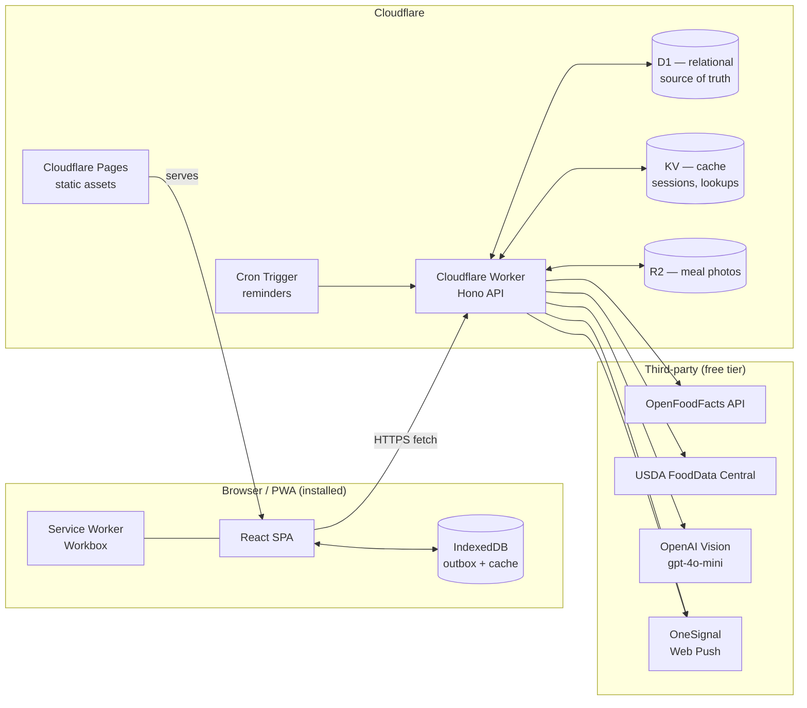
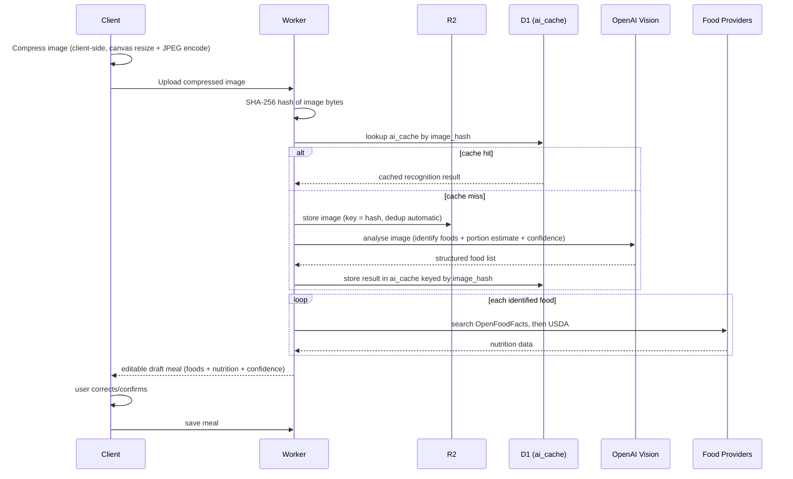

# OmNomNom — Architecture (Stage 1)

Personal nutrition tracker for two users. Every decision below is optimised for **$0–2/month operating cost**, low operational burden, and a clean path to the "Future Features" list without rewrites.

---

## 1. High-level system



**One Worker, one API, one D1 database.** No microservices — with two users there is nothing to gain from splitting services, and every split adds cold-starts, cross-service auth, and cost. Everything backend-side lives in a single Hono app deployed as one Worker, organised internally into route/service modules (see Stage 2).

---

## 2. Repository shape (preview — finalised in Stage 2)

A single monorepo, npm workspaces:

```
omnomnom/
├── apps/
│   ├── web/          React PWA (Vite)
│   └── api/           Cloudflare Worker (Hono)
├── packages/
│   ├── shared/        Zod schemas, types, nutrition/score math — used by both apps
│   └── db/             D1 schema, migrations, seed data
└── .github/workflows/  CI/CD
```

Sharing `packages/shared` between frontend and Worker means calorie math, the scoring algorithm, and validation schemas are defined **once** and can't drift between client-side optimistic UI and server-side calculation.

---

## 3. Frontend architecture

- **Vite + React + TypeScript**, SPA with React Router (no SSR needed — this is a private, authenticated app, so there's no SEO/first-paint case for server rendering).
- **TanStack Query** owns all server state (meals, foods, weights, water, analytics). Mutations are optimistic: the UI updates immediately, reconciles on response, and rolls back on failure.
- **React Hook Form + Zod** for every form (registration, food entry, custom recipes, settings). The same Zod schemas are imported from `packages/shared` and reused as the Worker's request validators — one schema, enforced on both ends.
- **shadcn/ui + Tailwind** for components, themed via CSS variables for the burnt-orange/peach/sage palette and dark-mode warm-brown.
- **State that isn't server state** (theme, unit preference, onboarding step) lives in small Zustand-free React context or `useReducer` — no Redux; there's not enough client-only state to justify it.
- **PWA layer**: `vite-plugin-pwa` (Workbox under the hood) generates the manifest, service worker, and precache manifest as part of the Vite build — not hand-rolled.

## 4. Backend architecture

- **Hono** as the router/middleware framework — it's built for Workers (no Node API assumptions), has first-class TypeScript, and its middleware model (auth, rate-limit, validation) keeps route handlers thin.
- Routes are grouped by domain: `auth`, `users`, `goals`, `meals`, `foods`, `water`, `weight`, `analytics`, `notifications`, `settings`, `ai`. Each domain has a route file + a service file (business logic) + repository functions (D1 queries) — service logic never touches raw SQL directly from route handlers, so it's testable without a live D1 binding.
- **Auth**: JWT access token (short-lived, ~15 min) issued on login, verified via HMAC (Web Crypto `SubtleCrypto`, no external JWT lib needed). A longer-lived refresh token is stored httpOnly + `Secure` + `SameSite=Strict`. Passwords hashed with PBKDF2-SHA256 via `SubtleCrypto` (bcrypt isn't available in the Workers runtime; PBKDF2 with a high iteration count is the standard Workers-compatible substitute). Login endpoint is rate-limited using a KV-backed counter (fixed window, keyed by IP+email).
- Because there are exactly two users, there is **no multi-tenant complexity, no roles/permissions system, no admin panel** — just `user_id` scoping on every query. The future "Family accounts" feature is kept possible by never hardcoding "2 users" into the schema, only into things like default rate-limit thresholds.

## 5. Data architecture

| Store            | Used for                                                                                                                | Why                                                                                                                                                                                                                                                                                                                         |
| ---------------- | ----------------------------------------------------------------------------------------------------------------------- | --------------------------------------------------------------------------------------------------------------------------------------------------------------------------------------------------------------------------------------------------------------------------------------------------------------------------- |
| **D1**           | Users, goals, meals, meal items, foods, recipes, weight logs, water logs, notification settings, app settings, AI cache | Source of truth. Relational integrity (foreign keys, joins for analytics) matters here.                                                                                                                                                                                                                                     |
| **KV**           | Session/refresh-token lookups, food-search response cache, recent-search cache                                          | Eventually-consistent, low-latency, TTL-native — exactly what a cache needs, and D1 doesn't do TTL natively.                                                                                                                                                                                                                |
| **R2**           | Meal photos                                                                                                             | Zero egress fees, S3-compatible, content-addressed storage avoids duplicate uploads (see §6).                                                                                                                                                                                                                               |
| **Cron Trigger** | Reminder scheduling                                                                                                     | Free, built into Workers — no need for an external scheduler.                                                                                                                                                                                                                                                               |
| **Queues**       | _Not used initially_                                                                                                    | With 2 users, AI photo analysis (a few seconds) can run synchronously inside the request. Queues are designed in as a drop-in for Stage-later if photo volume ever makes that latency annoying — the AI service is written behind an interface so swapping "call inline" for "enqueue and poll" doesn't touch calling code. |

## 6. AI photo pipeline



Key cost-control decisions:

- **Content-addressed storage**: the image's SHA-256 hash is both the cache key and the R2 object key, so the same photo (or a re-upload of an identical photo) never calls OpenAI or stores a duplicate blob twice.
- **AI never invents nutrition numbers** — its only job is _identification_ (food name, portion estimate, confidence). Nutrition values always come from OpenFoodFacts/USDA; AI output is discarded if a database match exists.
- Model choice: `gpt-4o-mini` (vision-capable, materially cheaper than `gpt-4o`) — configurable via env var so it can be upgraded without a code change.

## 7. Food search architecture

A `FoodProvider` interface (`search(query): Promise<Food[]>`) with two implementations, tried in order: `OpenFoodFactsProvider` → `UsdaFoodDataProvider`. The orchestrator is a thin loop over providers, returning the first non-empty result set. This makes "add barcode lookup" (Future Features) a matter of adding a third provider — no orchestration changes.

Every result that gets used in a logged meal is upserted into the local `foods` table, so:

- It's available offline immediately after first use.
- Repeated searches for the same food don't re-hit external APIs (KV cache in front, D1 as permanent local record behind).

## 8. Nutrition Score engine

Lives in `packages/shared/scoring` as a pure function: `calculateScore(dailyLog, targets, weights) → { score, breakdown }`. Weights (calories 30%, protein 25%, fibre 15%, water 10%, consistency 10%, meal timing 5%, weight trend 5%) are a config object, not hardcoded constants — overridable later from Settings without touching the algorithm. Being a pure function with no I/O, it runs identically client-side (instant optimistic score update the moment a meal is logged) and server-side (authoritative recompute on write), and is trivially unit-testable.

## 9. Offline & sync architecture

- Workbox precaches the app shell (JS/CSS/fonts/icons) for instant offline load.
- Mutations (log meal, log water, log weight) always write to **IndexedDB first** (outbox pattern) and update the UI optimistically, regardless of connectivity.
- A sync manager drains the outbox whenever `navigator.onLine` flips true, or via the Background Sync API when supported (iOS Safari lacks Background Sync, so a foreground "flush on app open/visibility-change" fallback covers it).
- Each queued mutation carries a client-generated UUID and client timestamp. The Worker's write endpoints are idempotent on that UUID (safe to retry) and conflict resolution is **last-write-timestamp-wins**, matching the spec.

## 10. Notifications architecture

- OneSignal Web Push SDK loaded client-side; the permission-request flow is a dedicated onboarding page (not a browser popup on load — better opt-in rates and required for iOS PWA push anyway).
- `notification_settings` in D1 holds per-user schedules (breakfast/lunch/dinner/water/weigh-in/custom), quiet hours, and weekday/weekend variants.
- A Cron Trigger (runs every 5–15 min) checks which reminders are due "now" per user's timezone/schedule and calls the OneSignal REST API server-side to send. This keeps all scheduling logic in one place (the Worker), rather than relying on OneSignal's own segment-based scheduling, which would be harder to keep in sync with user-edited schedules.

## 11. Deployment architecture

- **Frontend**: `apps/web` builds to static assets, deployed to **Cloudflare Pages**.
- **Backend**: `apps/api` deployed as a **Cloudflare Worker** via Wrangler, bound to D1/KV/R2/Cron in `wrangler.toml`.
- **CI/CD**: GitHub Actions — one workflow runs typecheck + lint + unit tests on every PR; a deploy workflow (on merge to `main`) builds and deploys both Pages and the Worker, and runs any pending D1 migrations.
- Single environment (production) to start — no staging cluster to pay for or maintain with 2 users. PR preview deploys use Cloudflare Pages' free preview-deployment feature, pointed at the same D1/KV (safe, since this is personal-use and migrations are additive-first).

## 12. Security posture

- All input validated with Zod at the Worker boundary (shared schemas with the frontend forms).
- Passwords: PBKDF2-SHA256, per-user salt, high iteration count, via Web Crypto.
- JWT signed with a secret stored as a Wrangler secret (never in source, never in the KV/D1 data itself).
- Auth endpoints rate-limited via KV counters.
- CORS locked to the Pages origin; all cookies `Secure`/`httpOnly`/`SameSite=Strict`.
- No secrets ever shipped to the client bundle — the OpenAI key and OneSignal REST key live only in Worker secrets, never exposed via any API response.

## 13. Cost model (why this stays near $0)

| Service                     | Free tier                                             | Expected usage (2 users)             | Cost        |
| --------------------------- | ----------------------------------------------------- | ------------------------------------ | ----------- |
| Cloudflare Pages            | Unlimited requests/sites                              | Full app                             | $0          |
| Cloudflare Workers          | 100k requests/day                                     | Low hundreds/day                     | $0          |
| D1                          | 5GB storage, 5M row-reads/day                         | Trivial at this scale                | $0          |
| KV                          | 100k reads/day, 1k writes/day                         | Cache lookups                        | $0          |
| R2                          | 10GB storage, **no egress fee**                       | Meal photos, deduped                 | $0          |
| OneSignal                   | Free web push, no user cap relevant here              | Reminders                            | $0          |
| OpenAI Vision (gpt-4o-mini) | Pay-per-use only                                      | A few photo logs/day, deduped+cached | ~$0.50–2/mo |
| GitHub Actions              | 2,000 min/month free (public) or private free minutes | CI/CD                                | $0          |

The **only variable cost is OpenAI Vision**, and it's the one place cost optimisation (§6) was designed in deliberately.

## 14. Extensibility hooks for "Future Features"

These aren't built now, but the architecture leaves room so they don't force a rewrite later:

- **Barcode scanning** → a third `FoodProvider` implementation.
- **Apple Health / Google Fit / Health Connect / Garmin / Fitbit** → a `HealthSyncAdapter` interface (mirrors `FoodProvider`'s shape) writing into the same `weight_logs`/`water_logs` tables; none of these platforms are integrated yet, so nothing is stubbed — just the seam is anticipated.
- **Recipe builder / meal planner / shopping list** → `recipes` table already in Stage-3 schema; planner and shopping-list are new tables + routes, no changes to existing ones.
- **Restaurant nutrition lookup** → another `FoodProvider`.
- **Intermittent fasting** → new table + dashboard widget; doesn't touch meal/food logging.
- **Coach mode / Premium / Family accounts** → the `users` table and JWT claims are structured so a `role` and `household_id` column can be added additively later without migrating existing rows.

---

### Open decisions I made without asking (flag if you'd rather change them)

1. **Hono** over raw Workers `fetch` handler or itty-router — chosen for DX and middleware ergonomics; trivial to swap early if you disagree.
2. **PBKDF2 over bcrypt/argon2** for password hashing — required by the Workers runtime, not a preference.
3. **No staging environment** — matches "2 users, personal use"; easy to add a second Pages project + Worker environment later if you want one.
4. **Queues deferred, not built** — added the seam, not the implementation, per the "optional" note in the spec.

---

Next stage (2): folder structure — the concrete `apps/`, `packages/` layout with every subdirectory, naming conventions, and shared tooling config (TS project references, ESLint, Prettier, path aliases). Let me know if you want changes here first, otherwise I'll continue.
